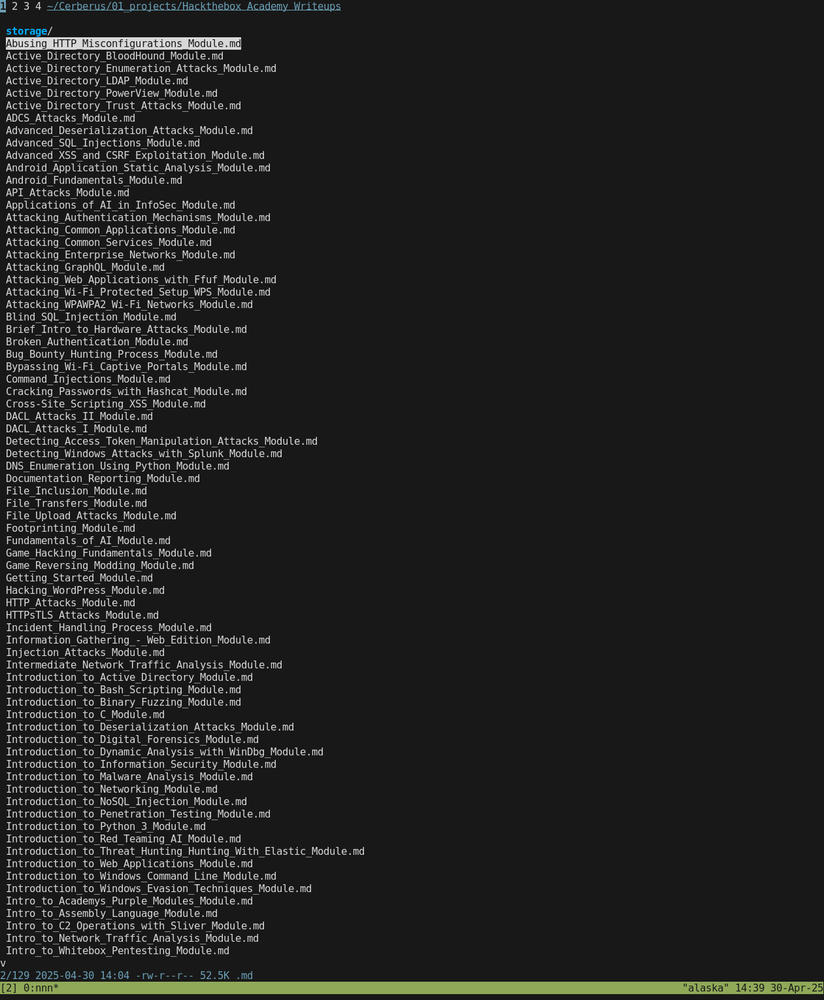

# Hackthebox Academy Writeup Downloader

- You need an account/subscription with authorization to download the academy writeups
- Hackthebox requires you to accept that you will not share the writeups
- They send the response JSON before/even if you don't accept the agreement
- No I will not share the writeups, I just wanted to archive it somewhere

## Usage

- Copy a legimate request with Burpsuite, use this to populate `cookies.json` and `headers.json`
- Use the included `nix-shell` or a python virtual environment for dependencies

## Output

- The script outputs markdown files titled after the lab name
- The script downloads all images and creates relative links so that the images display in Obsidian
- Kind of like a reverse static site generator

## Writeups

